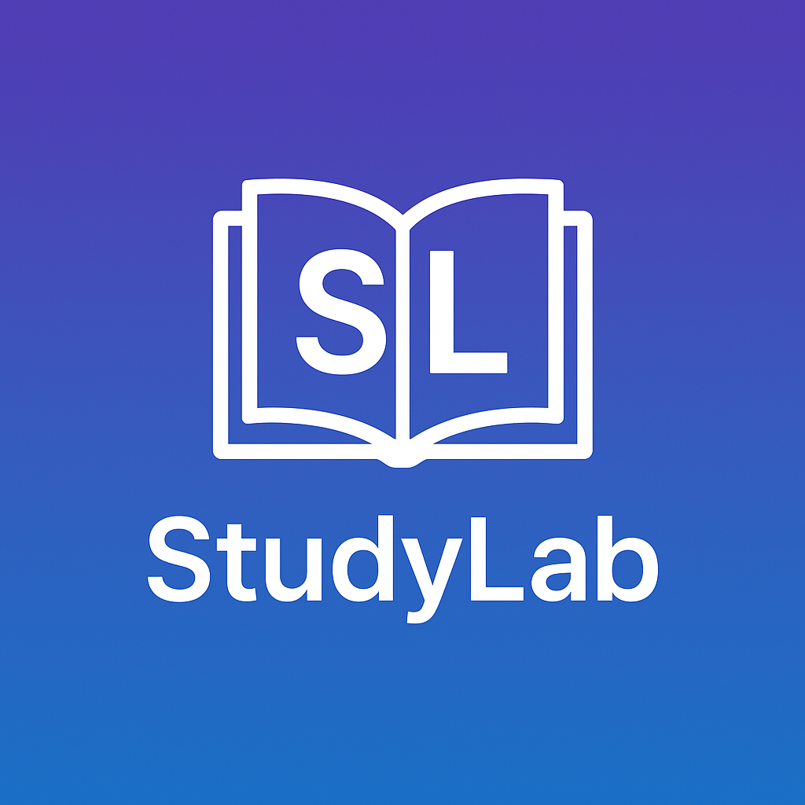

# 📘 StudyLab — Luyện thi Lịch sử 2026



**StudyLab** là ứng dụng web tĩnh giúp học sinh ôn luyện môn **Lịch sử THPT Quốc gia 2026**, 
tích hợp kiến thức từ 3 bộ sách giáo khoa mới (Cánh Diều, Kết Nối Tri Thức, Chân Trời Sáng Tạo).  
Ứng dụng có sẵn hệ thống đăng nhập, quản trị học viên, bài tập trắc nghiệm và xuất kết quả.

---

## 🚀 Tính năng chính

- 🧠 Ôn luyện theo **chủ đề – bài tập – đáp án**
- 🔐 Mở khóa bài học (mật khẩu mặc định: `8888`)
- 👥 Đăng ký / đăng nhập học viên (lưu cục bộ)
- 🧾 Quản trị viên xem kết quả, sao lưu và export CSV
- 💾 Lưu tiến trình học trên **LocalStorage**
- 🌐 Chạy trực tiếp trên **GitHub Pages**

---

## ⚙️ Cách triển khai trên GitHub Pages

1. Tạo repository mới tại [https://github.com/new](https://github.com/new)
2. Upload toàn bộ các file:
   ```
   index.html
   app_upgraded.js
   sections.json
   favicon.png
   LICENSE
   README.md
   ```
3. Vào **Settings → Pages**
   - Chọn: `Branch: main` → `Folder: /(root)`  
   - Nhấn **Save**
4. Truy cập sau vài phút tại:
   ```
   https://<tên-người-dùng>.github.io/studylab/
   ```

---

## 🖼 Giao diện minh họa


---

## 🧑‍💻 Tác giả & Bản quyền

- **Nhóm biên soạn:** TikTok [@thptqg2025](https://www.tiktok.com/@thptqg2025)  
- **Phát triển ứng dụng:** StudyLab Team  
- **Giấy phép:** MIT License

---

> ✨ *“Học thông minh – Luyện vững chắc – Thi tự tin với StudyLab”*  
